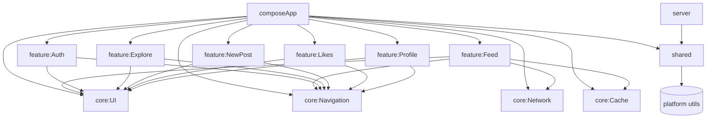
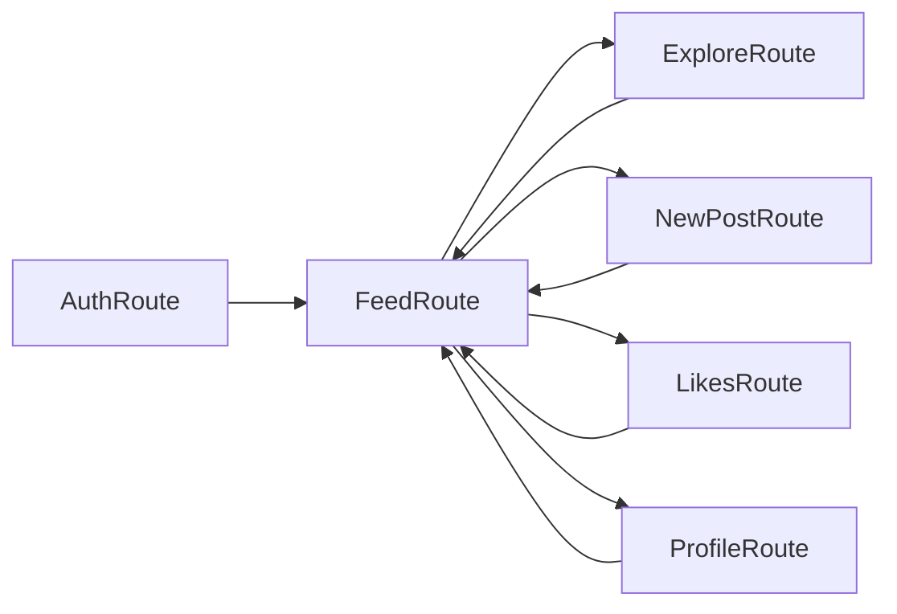
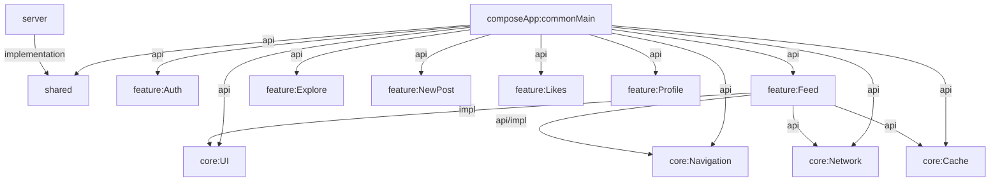

# Kotlin Multiplatform Instagram Clone


A reference **Kotlin Multiplatform (KMP)** project recreating an Instagram-style application across:

- **Android**
- **iOS**
- **Desktop (JVM)**
- **Web (JS + Wasm)**
- **Ktor Server Backend**

It showcases **vertical, feature-first modularization** with **strict Clean Architecture**, shared logic, typed navigation, Composable UI, Ktor networking, SQLDelight storage, and fully isolated feature slices.

---

# 📁 Folder Structure

```text
composeApp/
  androidMain/
  iosMain/
  commonMain/
  jvmMain/
  webMain/

core/
  UI/
  Navigation/
  Network/
  Cache/

feature/
  Auth/
  Feed/
  Explore/
  NewPost/
  Likes/
  Profile/

shared/

server/
```

---

# 📦 Dependency Graph



---

# 🧭 Navigation Flow



---

# 🔧 Gradle Dependency Flow



---

# 🏗 Architecture Overview

The architecture follows **Clean Architecture**, **multiplatform modularization**, and **feature isolation**, allowing each layer to scale independently.

## 📱 composeApp/
The cross-platform entry point containing:

- Root `App()` composable  
- Koin bootstrap  
- App theme  
- Navigation host  
- Top & bottom bars  
- Typed route registry  

---

## 🧩 core/
Shared foundation modules:

### `core:UI`
- Theme + color system  
- AppScaffold  
- TopAppBar, BottomNavigation  
- UI config provider  

### `core:Navigation`
- Typed route system using `@Serializable`
- FeatureEntry registration
- Centralized NavHost wiring

### `core:Network`
- Ktor HttpClient wrapper  
- Retry, timeouts, JSON, base-URL config  
- Safe `Result<T>` helpers: `getSafe`, `postSafe`, etc.

### `core:Cache`
- SQLDelight setup  
- Multiplatform drivers (Android/iOS/JS/JVM)  

---

## 🔁 shared/
Pure KMP utilities shared everywhere:

- Expect/actual platform APIs  
- Coroutine dispatchers  
- Logging utils  
- Constants & configuration  

---

## 🧱 feature/
True *vertical slices* containing:

- UI (Compose)  
- State (ViewModel + events + reducers)  
- Domain (models + repositories)  
- Data (remote + cache + mappers)  
- Navigation entry (FeatureEntry)  
- DI module  

Features included: **Auth**, **Feed**, **Explore**, **NewPost**, **Likes**, **Profile**.

Each feature depends on **core**, but never on other features.

---

## 🌐 server/
A lightweight **Ktor** backend:

- Reuses shared data models  
- Exposes REST APIs  
- Demonstrates full multiplatform sharing (e.g., constants, DTOs)

---

# 🧩 DI Bootstrap Example

```kotlin
fun initKoin(appDeclaration: KoinAppDeclaration = {}) {
    startKoin {
        appDeclaration()
        modules(
            sharedModule,
            networkModule,
            cacheModule,
            authModule,
            feedModule,
            exploreModule,
            newPostModule,
            likesModule,
            profileModule
        )
    }
}
```

---

# 🚀 Getting Started

### Android
```bash
./gradlew :composeApp:assembleDebug
```

### Desktop (JVM)
```bash
./gradlew :composeApp:run
```

### Web (JS)
```bash
./gradlew :composeApp:jsBrowserDevelopmentRun
```

### Web (Wasm)
```bash
./gradlew :composeApp:wasmJsBrowserDevelopmentRun
```

### iOS
Open in Xcode or run from IntelliJ.

### Server
```bash
./gradlew :server:run
```

---

# 📄 License

MIT License — see `LICENSE`.
